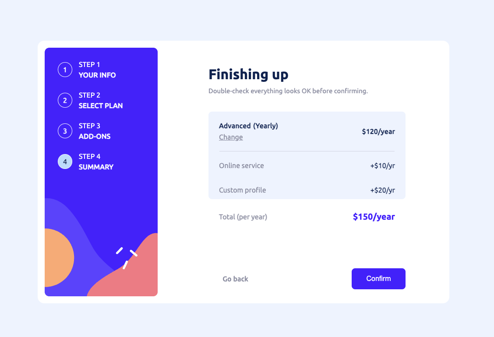

# Frontend Mentor - Multi-step form solution

This is a solution to the [Multi-step form challenge on Frontend Mentor](https://www.frontendmentor.io/challenges/multistep-form-YVAnSdqQBJ). Frontend Mentor challenges help you improve your coding skills by building realistic projects. 

## Table of contents

- [Overview](#overview)
  - [The challenge](#the-challenge)
  - [Screenshot](#screenshot)
  - [Links](#links)
- [My process](#my-process)
  - [Built with](#built-with)
  - [What I learned](#what-i-learned)
- [Author](#author)


## Overview

### The challenge

Users should be able to:

- Complete each step of the sequence
- Go back to a previous step to update their selections
- See a summary of their selections on the final step and confirm their order
- View the optimal layout for the interface depending on their device's screen size
- See hover and focus states for all interactive elements on the page
- Receive form validation messages if:
  - A field has been missed
  - The email address is not formatted correctly
  - A step is submitted, but no selection has been made

### Screenshot

#### Step 1 - Information


#### Step 2 - The plan


#### Step 3 - Add-ons


#### Step 4 - Summary


#### Step 5 - Confirmation


### Links

- Solution URL: [Github repository](https://github.com/seg1-exe/multi-step-form)
- Live Site URL: [Github pages](https://seg1-exe.github.io/multi-step-form/)

## My process

### Built with

- Semantic HTML5 markup
- CSS custom properties
- Flexbox
- Vanilla Javascript

### What I learned

Thanks to this challenge, I was able to work on my knowledge of Javascript and my reasoning to understand what I wanted to do.

```js
if (name.trim() === '' ){
        /* if the name is empty */
        nameContainer.classList.add('step-1-input-error');
        nameError.classList.remove('hidden');
    } else {
        /* if the name is not empty */
        nameContainer.classList.remove('step-1-input-error');
        nameError.classList.add('hidden');
        if (email.trim() === '' ){
            /* if the email is empty */
            emailContainer.classList.add('step-1-input-error');
            emailError.classList.remove('hidden');
        } else {
            /* if the email is not empty */
            emailContainer.classList.remove('step-1-input-error');
            emailError.classList.add('hidden');
            if (phone.trim() === '' ){
                /* if the phone is empty */
                phoneContainer.classList.add('step-1-input-error');
                phoneError.classList.remove('hidden');
            } else {
                /* if the phone is not empty */
                /* move to the next step */
                phoneContainer.classList.remove('step-1-input-error');
                phoneError.classList.add('hidden');
                step1.classList.remove('step-container-active');
                step1.classList.add('hidden');
                step1sidebar.classList.remove('sidebar-element-number-active');
                step2sidebar.classList.add('sidebar-element-number-active');
                step2.classList.remove('hidden');
                step2.classList.add('step-container-active');
            }
        }
```
I love this snippet of code that lets me check the state of the form in step 1, it's not perfect and could be improved but I like it like this

## Author

- My bento - [seg1](https://bento.me/seg1)
- Frontend Mentor - [@seg1](https://www.frontendmentor.io/profile/Rutabagarre)
- Twitter - [@seg1_exe](https://twitter.com/seg1_exe)


